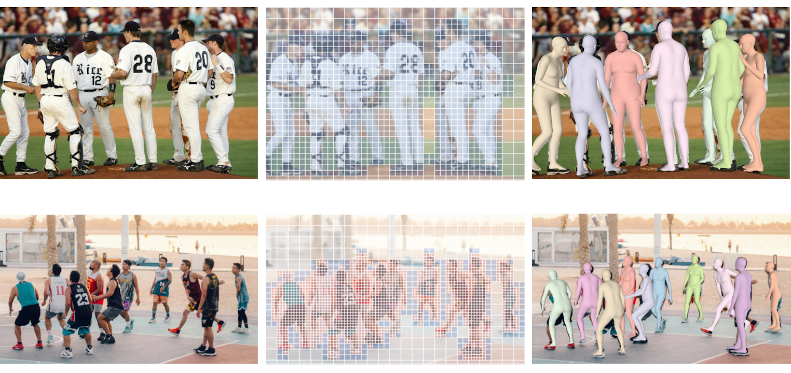

<h1 align="center">SAT-HMR: Real-Time Multi-Person 3D Mesh Estimation via Scale-Adaptive Tokens</h1>

<h4 align="center" style="text-decoration: none;">
  <a href="https://github.com/ChiSu001/", target="_blank"><b>Chi Su</b></a>
  ,
  <a href="https://shirleymaxx.github.io/", target="_blank"><b>Xiaoxuan Ma</b></a>
  ,
  <a href="https://scholar.google.com/citations?user=DoUvUz4AAAAJ&hl=en", target="_blank"><b>Jiajun Su</b></a>
  ,
  <a href="https://cfcs.pku.edu.cn/english/people/faculty/yizhouwang/index.htm", target="_blank"><b>Yizhou Wang</b></a>

</h4>

<div align="center">
  <a href="https://pytorch.org/get-started/locally/"></a> 
  <a href="https://arxiv.org/abs/2411.19824"></a> 
  <a href="https://ChiSu001.github.io/SAT-HMR"></a> 
  <a href="https://youtu.be/tqURcr_nCQY"></a> 
  <a href="https://huggingface.co/ChiSu001/SAT-HMR"></a> 
</div>


<div align="center">
  
  
</div>

<h3> Overview of SAT-HMR </h3>

<p align="center">
  
</p>

<!-- <p align="center">
  
</p> -->

## News :triangular_flag_on_post:

[2025/02/18] Training/evaluation code and data preparation released!

[2025/01/18] Model released on [🤗HuggingFace](https://huggingface.co/ChiSu001/SAT-HMR)!

[2024/11/29] Inference code and weights released. Try inference your images!

## TODO :white_check_mark:

- [x] Provide inference code, support image folder input
- [x] Provide code and data for training or evaluation

## Installation

We tested with python 3.11, PyTorch 2.4.1 and CUDA 12.1.

1. Clone the repo and create a conda environment.
```bash
git clone https://github.com/ChiSu001/sat-hmr.git
cd sat-hmr
conda create -n sathmr python=3.11 -y
conda activate sathmr
```

2. Install [PyTorch](https://pytorch.org/) and [xFormers](https://github.com/facebookresearch/xformers).
```bash
# Install PyTorch. It is recommended that you follow [official instruction](https://pytorch.org/) and adapt the cuda version to yours.
conda install pytorch==2.4.1 torchvision==0.19.1 torchaudio==2.4.1 pytorch-cuda=12.1 -c pytorch -c nvidia

# Install xFormers. It is recommended that you follow [official instruction](https://github.com/facebookresearch/xformers) and adapt the cuda version to yours.
pip install -U xformers==0.0.28.post1  --index-url https://download.pytorch.org/whl/cu121
```

3. Install other dependencies.
```bash
pip install -r requirements.txt
```

4. You may need to modify `chumpy` package to avoid errors. For detailed instructions, please check [this guidance](docs/fix_chumpy.md).

## Download Models & Weights

1. Download SMPL-related weights.
   - Download `basicModel_f_lbs_10_207_0_v1.0.0.pkl`, `basicModel_m_lbs_10_207_0_v1.0.0.pkl`, and `basicModel_neutral_lbs_10_207_0_v1.0.0.pkl` from [here](https://smpl.is.tue.mpg.de/) (female & male) and [here](http://smplify.is.tue.mpg.de/) (neutral) to `${Project}/weights/smpl_data/smpl`. Please rename them as `SMPL_FEMALE.pkl`, `SMPL_MALE.pkl`, and `SMPL_NEUTRAL.pkl`, respectively.
   - Download others from [Google drive](https://drive.google.com/drive/folders/1wmd_pjmmDn3eSl3TLgProgZgCQZgtZIC?usp=sharing) and put them to `${Project}/weights/smpl_data/smpl`.

2. Download DINOv2 pretrained weights from [their official repository](https://github.com/facebookresearch/dinov2?tab=readme-ov-file#pretrained-models). We use `ViT-B/14 distilled (without registers)`. Please put `dinov2_vitb14_pretrain.pth` to `${Project}/weights/dinov2`. These weights will be used to initialize our encoder. **You can skip this step if you are not going to train SAT-HMR.**

3. Download pretrained weights for inference and evaluation from [Google drive](https://drive.google.com/drive/folders/1L09zt5lQ2RVK2MS2DwKODpdTs9K6CQPC?usp=sharing) or [🤗HuggingFace](https://huggingface.co/ChiSu001/SAT-HMR/blob/main/weights/sat_hmr). Please put them to `${Project}/weights/sat_hmr`.

Now the `weights` directory structure should be like this. 

```
${Project}
|-- weights
    |-- dinov2
    |   `-- dinov2_vitb14_pretrain.pth
    |-- sat_hmr
        |-- sat_644_3dpw.pth
        |-- sat_644_agora.pth
    |   `-- sat_644.pth
    `-- smpl_data
        `-- smpl
            |-- body_verts_smpl.npy
            |-- J_regressor_h36m_correct.npy
            |-- SMPL_FEMALE.pkl
            |-- SMPL_MALE.pkl
            |-- smpl_mean_params.npz
            `-- SMPL_NEUTRAL.pkl
```

## Data Preparation

Please follow [this guidance](docs/data_preparation.md) to prepare datasets and annotations. **You can skip this step if you are not going to train or evaluate SAT-HMR.**

We provide the script `${Project}/debug_data.py` to verify that the data has been correctly prepared and visualize the GTs:

```bash
python debug_data.py
```

Visualization results will be saved in `${Project}/datasets_visualization`.

## Inference on Images
<h4> Inference with 1 GPU</h4>

We provide some demo images in `${Project}/demo`. You can run SAT-HMR on all images on a single GPU via:


```bash
python main.py --mode infer --cfg demo
```

Results with overlayed meshes will be saved in `${Project}/demo_results`.

You can specify your own inference configuration by modifing `${Project}/configs/run/demo.yaml`:

- `input_dir` specifies the input image folder.
- `output_dir` specifies the output folder.
- `conf_thresh` specifies a list of confidence thresholds used for detection. SAT-HMR will run inference using thresholds in the list, respectively.
- `infer_batch_size` specifies the batch size used for inference (on a single GPU).

<h4> Inference with Multiple GPUs</h4>

You can also try distributed inference on multiple GPUs if your input folder contains a large number of images. 
Since we use [🤗 Accelerate](https://huggingface.co/docs/accelerate/index) to launch our distributed configuration, first you may need to configure [🤗 Accelerate](https://huggingface.co/docs/accelerate/index) for how the current system is setup for distributed process. To do so run the following command and answer the questions prompted to you:

```bash
accelerate config
```

Then run:
```bash
accelerate launch main.py --mode infer --cfg demo
```

## Training and Evaluation

<h4> Training with Multiple GPUs</h4>

We use [🤗 Accelerate](https://huggingface.co/docs/accelerate/index) to launch our distributed configuration, first you may need to configure [🤗 Accelerate](https://huggingface.co/docs/accelerate/index) for how the current system is setup for distributed process. To do so run the following command and answer the questions prompted to you:

```bash
accelerate config
```

To train on all datasets, run:

```bash
accelerate launch main.py --mode train --cfg train_all
```

**Note**: Training on [AGORA](https://agora.is.tue.mpg.de/index.html) and [BEDLAM](https://bedlam.is.tue.mpg.de/index.html) datasets is sufficient to reproduce our results on the [AGORA Leaderboard](https://agora-evaluation.is.tuebingen.mpg.de/). If you wish to save time and not train on all datasets, you can modify `L39-40` in the `${Project}/run/train_all.yaml` config file.

<h4> Monitor Training Progress</h4>

Training logs and checkpoints will be saved in the `${Project}/outputs/logs` and `${Project}/outputs/ckpts` directories, respectively.

You can monitor the training progress using TensorBoard. To start TensorBoard, run:

```bash
tensorboard --logdir=${Project}/outputs/logs
```

<h4> Evaluation with 1 GPU</h4>

We provide code for evaluating on AGORA, BEDLAM and 3DPW. Evaluation results will be saved in `${Project}/results/${cfg_name}/evaluation`.

```bash
# Evaluate on AGORA-val and BEDLAM-val
# AGORA-val: F1: 0.95  MPJPE: 63.0  MVE: 59.0
# BEDLAM-val: F1: 0.98  MPJPE: 48.7  MVE: 46.2
python main.py --mode eval --cfg eval_ab

# Evaluate on 3DPW-test
# 3DPW-test: MPJPE: 63.6  PA-MPJPE: 41.6  MVE: 73.7
python main.py --mode eval --cfg eval_3dpw

# Evaluate on AGORA-test
# AGORA-test: F1: 0.95  MPJPE: 67.9  MVE: 63.3
# This will generate a zip file in `${Project}/results/test_agora/evaluation/agora_test/thresh_0.5` which can be submitted to [AGORA Leaderboard](https://agora-evaluation.is.tuebingen.mpg.de/)
python main.py --mode eval --cfg test_agora
```

<h4> Evaluation with Multiple GPUs</h4>

We recommend using a single GPU for evaluation as it provides more accurate results. However, we also provide code for distributed evaluation to obtain results faster.

```bash
# Multi-GPU configuration
accelerate config
# Evaluation
accelerate main.py --mode eval --cfg ${cfg_name}
```

## Citing

If you find this code useful for your research, please consider citing our paper:
```bibtex
@article{su2024sathmr,
      title={SAT-HMR: Real-Time Multi-Person 3D Mesh Estimation via Scale-Adaptive Tokens},
      author={Su, Chi and Ma, Xiaoxuan and Su, Jiajun and Wang, Yizhou},
      journal={arXiv preprint arXiv:2411.19824},
      year={2024}
    }
```

## Acknowledgement
This repo is built on the excellent work [DINOv2](https://github.com/facebookresearch/dinov2), [DAB-DETR](https://github.com/IDEA-Research/DAB-DETR), [DINO](https://github.com/IDEA-Research/DINO) and [🤗 Accelerate](https://huggingface.co/docs/accelerate/index). Thanks for these great projects.

